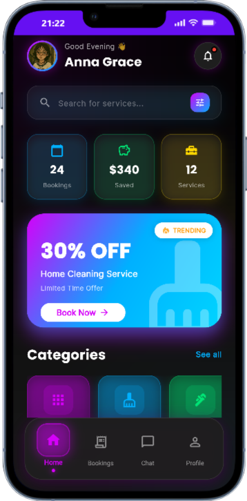
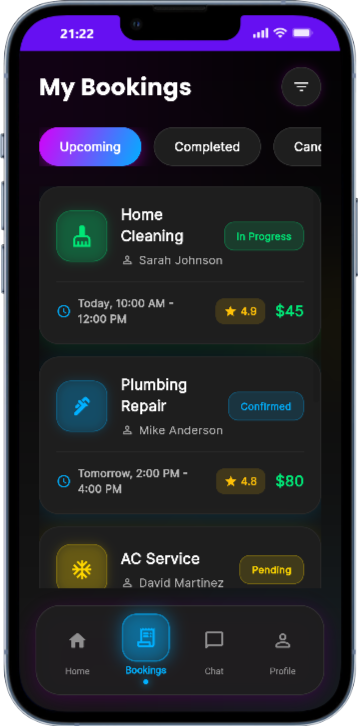
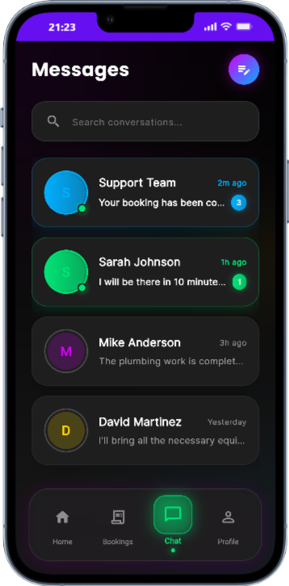
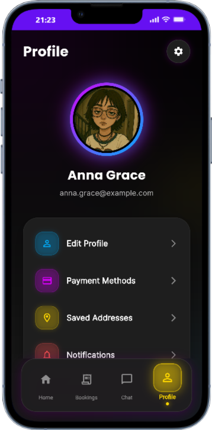

# 🏠 Home Service App

A premium, modern Flutter application for booking home services with a stunning dark theme UI featuring neon accents, glassmorphism effects, and smooth animations.


## ✨ Features

### 🎨 Premium UI/UX Design
- **Dark Theme** with neon color accents (Purple, Blue, Green, Gold)
- **Glassmorphism effects** throughout the app
- **Smooth animations** using flutter_animate
- **Bold typography** with Google Fonts (Poppins, Inter)
- **Responsive layout** optimized for all screen sizes

### 📱 Core Functionality
- **Home Screen** with stats dashboard, featured services carousel, and quick actions
- **Services Listing** with premium service cards
- **Bookings Management** with status tracking and provider details
- **Chat Interface** with online status indicators and unread message counts
- **User Profile** with settings and account management

### 🚀 Key Highlights
- Stats Dashboard (Bookings, Savings, Services Used)
- Featured Services Carousel
- Premium Category Cards with service counts
- Top-Rated Services showcase
- Quick Action buttons (Emergency, Track Booking)
- Refer & Earn program
- Real-time booking status updates
- Interactive chat with service providers

## 📸 Screenshots

### Home Screen

*Premium dark theme with stats dashboard, featured services, and quick actions*

### Bookings

*Booking management with status tracking and provider details*

### Chat

*Real-time chat with online indicators and unread counts*

### Profile

*User profile with settings and neon glow effects*

## 🛠️ Tech Stack

- **Framework**: Flutter 3.x
- **Language**: Dart
- **State Management**: StatelessWidget (Simple state)
- **Animations**: flutter_animate
- **Fonts**: Google Fonts (Poppins, Inter)
- **UI Components**: Custom widgets with premium styling

## 📦 Dependencies

```yaml
dependencies:
  flutter:
    sdk: flutter
  google_fonts: ^6.1.0
  flutter_animate: ^4.5.0
```

## 🚀 Getting Started

### Prerequisites
- Flutter SDK (3.0 or higher)
- Dart SDK (3.0 or higher)
- Android Studio / VS Code
- Android Emulator or Physical Device

### Installation

1. **Clone the repository**
   ```bash
   git clone https://github.com/yourusername/home-service-app.git
   cd home-service-app
   ```

2. **Install dependencies**
   ```bash
   flutter pub get
   ```

3. **Run the app**
   ```bash
   flutter run
   ```

## 📁 Project Structure

```
lib/
├── main.dart                 # App entry point
├── screens/
│   ├── home_screen.dart      # Home screen with stats & featured services
│   ├── services_screen.dart  # Services listing
│   ├── bookings_screen.dart  # Bookings management
│   ├── chat_screen.dart      # Chat interface
│   ├── profile_screen.dart   # User profile
│   ├── details_screen.dart   # Service details
│   └── main_wrapper.dart     # Bottom navigation wrapper
├── widgets/
│   ├── premium_bottom_nav.dart   # Custom bottom navigation
│   ├── premium_background.dart   # Gradient background
│   ├── service_card.dart         # Service card component
│   └── glass_container.dart      # Glassmorphism container
└── theme/
    └── app_theme.dart        # App-wide theme & colors
```

## 🎨 Design System

### Color Palette
- **Background Dark**: `#000000` (Pure Black)
- **Surface Dark**: `#1E1E1E` (Dark Grey)
- **Neon Purple**: `#D500F9`
- **Neon Blue**: `#00B0FF`
- **Neon Green**: `#00E676`
- **Gold Accent**: `#FFD700`

### Typography
- **Display**: Poppins Bold (24-36px)
- **Body**: Poppins/Inter Regular (14-18px)
- **Small**: Inter Regular (11-13px)

### Components
- **Cards**: Dark surface with neon borders and glows
- **Buttons**: Gradient backgrounds with shadows
- **Icons**: Neon colored with glow effects
- **Animations**: Staggered fade-in, slide, and scale

## 🌟 Key Features Breakdown

### Home Screen
- User avatar with neon glow
- Stats dashboard (3 cards)
- Premium search bar with filter
- 3D promo card with TRENDING badge
- Premium category cards (5 categories)
- Featured services carousel
- Top-rated services (3 items)
- Quick action buttons
- Refer & earn section

### Bookings Screen
- Filter tabs (All, Upcoming, Completed, Cancelled)
- Booking cards with:
  - Service icon with colored glow
  - Provider name
  - Date & time range
  - Status badge
  - Star rating
  - Price display

### Chat Screen
- Search functionality
- Chat tiles with:
  - Avatar with gradient border
  - Online status indicator
  - Unread message count
  - Last message preview
  - Timestamp

### Profile Screen
- Profile picture with neon glow
- User information
- Settings options
- Logout functionality

## 🔧 Customization

### Changing Colors
Edit `lib/theme/app_theme.dart`:
```dart
static const Color neonPurple = Color(0xFFD500F9);
static const Color neonBlue = Color(0xFF00B0FF);
// Add your custom colors
```

### Adding New Services
Edit `lib/screens/services_screen.dart`:
```dart
ServiceData(
  title: 'Your Service',
  subtitle: 'Description',
  price: '\$XX',
  originalPrice: '\$YY',
  imagePath: 'assets/images/your_image.jpg',
  gradient: yourGradient,
  category: 'YourCategory',
),
```

## 📱 Supported Platforms
- ✅ Android
- ✅ iOS
- ⚠️ Web (Limited support)

## 🤝 Contributing
Contributions are welcome! Please feel free to submit a Pull Request.

## 📄 License
This project is licensed under the MIT License - see the LICENSE file for details.

## 👨‍💻 Author
**Annie**
- Email: annie@example.com

## 🙏 Acknowledgments
- Flutter team for the amazing framework
- Google Fonts for beautiful typography
- flutter_animate for smooth animations

---

<div align="center">
  Made with ❤️ using Flutter
</div>
